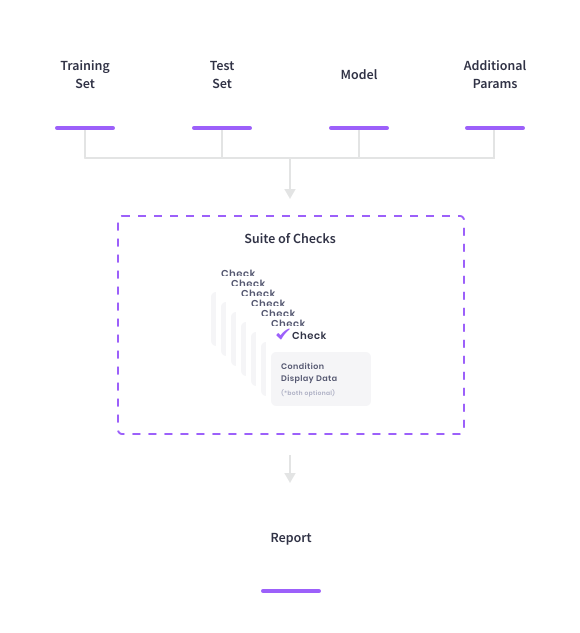

<!--
  ~ ----------------------------------------------------------------------------
  ~ Copyright (C) 2021 Deepchecks (https://www.deepchecks.com)
  ~
  ~ This file is part of Deepchecks.
  ~ Deepchecks is distributed under the terms of the GNU Affero General
  ~ Public License (version 3 or later).
  ~ You should have received a copy of the GNU Affero General Public License
  ~ along with Deepchecks.  If not, see <http://www.gnu.org/licenses/>.
  ~ ----------------------------------------------------------------------------
  ~
-->
# Deepchecks - Test Suites for ML Models and Data


Deepchecks is a Python package for comprehensively validating your machine learning
models and data with minimal effort.
This includes checks related to various types of issues, such as model performance,
data integrity, distribution mismatches, and more.

<p align="center">
   
</p>

## Key Concepts

### Check
Each check enables you to inspect a specific aspect of your data and models.
They are the basic building block of the deepchecks package, covering all kinds of common issues,
such as: PerformanceOverfit, DataSampleLeakage, SingleFeatureContribution,
DataDuplicates, and [many more checks](./notebooks/checks).
Each check can have two types of results:
1. A visual result meant for display (e.g. a figure or a table).
2. A return value that can be used for validating the expected check results
   (validations are typically done by adding a "condition" to the check, as explained below).

### Condition
A condition is a function that can be added to a Check, which returns a pass &#x2713;, fail &#x2716;
or warning &#x0021; result, intended for validating the Check's return value. An example for adding a condition would be:
```python
from deepchecks.checks import BoostingOverfit
BoostingOverfit().add_condition_test_score_percent_decline_not_greater_than(threshold=0.05)
```
which will fail if there is a difference of more than 5% between the best score achieved on the test set during
the boosting iterations and the score achieved in the last iteration (the model's "original" score on the test set).

### Suite
An ordered collection of checks, that can have conditions added to them.
The Suite enables displaying a concluding report for all of the Checks that ran.
[Here](deepchecks/suites) you can find the [predefined existing suites](deepchecks/suites) and a code example demonstrating how to build
your own custom suite. The existing suites include default conditions added for most of the checks.
You can edit the preconfigured suites or build a suite of your own with a collection of checks and optional conditions.

## Installation

### Using pip
```bash
pip install deepchecks #--user
```

### From source
First clone the repository and then install the package from inside the repository's directory:
```bash
git clone https://github.com/deepchecks/deepchecks.git
cd deepchecks
# for installing stable tag version and not the latest commit to main
git checkout tags/<version>
```
and then either:
```bash
pip install .
```
or
```bash
python setup.py install
```

## Are You Ready  to Start Checking?

For the full value from Deepchecks' checking suites, we recommend working with:

-   A model compatible with scikit-learn API that you wish to validate (e.g. RandomForest, XGBoost)
    
-   The model's training data with labels
    
-   Test data (on which the model wasn’t trained) with labels  

However, many of the checks and some of the suites need only a subset of the above to run.

## Usage Examples

### Running a Check
For running a specific check on your pandas DataFrame, all you need to do is:

```python
from deepchecks.checks import RareFormatDetection
import pandas as pd

df_to_check = pd.read_csv('data_to_validate.csv')
# Initialize and run desired check
RareFormatDetection().run(df_to_check)
```
Which might product output of the type:
><h4>Rare Format Detection</h4>
> <p>Check whether columns have common formats (e.g. 'XX-XX-XXXX' for dates) and detects values that don't match.</p>
> <p><b>&#x2713;</b> Nothing found</p>

If all was fine, or alternatively something like:
><h4>Rare Format Detection</h4>
><p>Check whether columns have common formats (e.g. 'XX-XX-XXXX' for dates) and detects values that don't match.</p>
>
>
> Column date:
> <table border="1" class="dataframe" style="text-align: left;">
>   <thead>
>     <tr>
>       <th class="blank level0" >&nbsp;</th>
>       <th class="col_heading level0 col0" >digits and letters format (case sensitive)</th>
>     </tr>
>   </thead>
>   <tbody>
>     <tr>
>       <th id="T_ae5e3_level0_row0" class="row_heading level0 row0" >ratio of rare samples</th>
>       <td id="T_ae5e3_row0_col0" class="data row0 col0" >1.50% (3)</td>
>     </tr>
>     <tr>
>       <th id="T_ae5e3_level0_row1" class="row_heading level0 row1" >common formats</th>
>       <td id="T_ae5e3_row1_col0" class="data row1 col0" >['2020-00-00']</td>
>     </tr>
>     <tr>
>       <th id="T_ae5e3_level0_row2" class="row_heading level0 row2" >examples for values in common formats</th>
>       <td id="T_ae5e3_row2_col0" class="data row2 col0" >['2021-11-07']</td>
>     </tr>
>     <tr>
>       <th id="T_ae5e3_level0_row3" class="row_heading level0 row3" >values in rare formats</th>
>       <td id="T_ae5e3_row3_col0" class="data row3 col0" >['2021-Nov-04', '2021-Nov-05', '2021-Nov-06']</td>
>     </tr>
>   </tbody> </table>

If mismatches were detected.

### Running a Suite
Let's take the "iris" dataset as an example:
```python
import pandas as pd
from sklearn.datasets import load_iris
from sklearn.model_selection import train_test_split
```
```python
iris_df = load_iris(return_X_y=False, as_frame=True)['frame']
label_col = 'target'
df_train, df_test = train_test_split(iris_df, stratify=iris_df[label_col], random_state=0)
```
To run an existing suite all you need to do is import the suite and run it -

```python
from deepchecks.suites import integrity_suite
suite = integrity_check_suite()
suite.run(train_dataset=df_train, test_dataset=df_test, check_datasets_policy='both')
```
Which will result in printing the summary of the check conditions and then the visual outputs of all of the checks that
are in that suite.

### Example Notebooks
For usage examples, check out: 
- [**Quickstart Notebook**](./notebooks/examples/quickstart_in_5_minutes.ipynb) - for running your first suite with a few lines of code.
- [**Example Checks Output Notebooks**](./notebooks/checks) - to see all of the existing checks and their usage examples.

## Communication
- Join our [Slack Community](https://join.slack.com/t/deepcheckscommunity/shared_invite/zt-y28sjt1v-PBT50S3uoyWui_Deg5L_jg) to connect with the maintainers and follow users and interesting discussions
- Post a [Github Issue](https://github.com/deepchecks/deepchecks/issues) to suggest improvements, open an issue, or share feedback.

[comment]: <> "- Send us an [email](mailto:info@deepchecks.com) at info@deepchecks.com"
