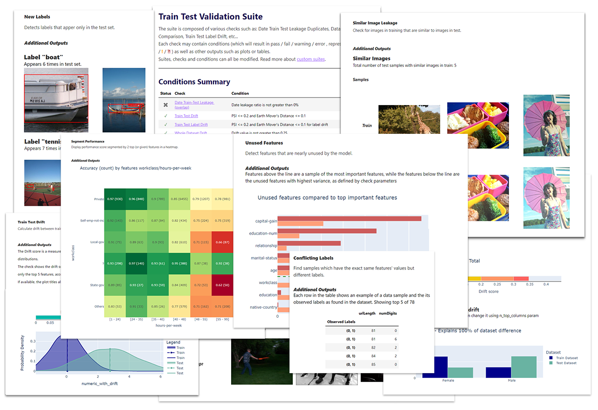
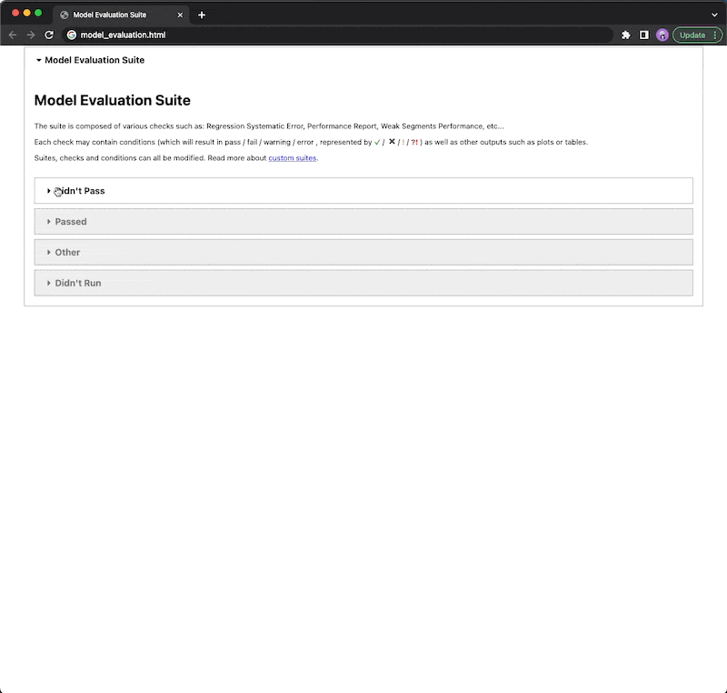
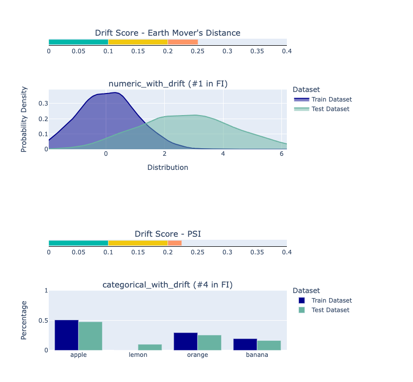

<!--
   ~ ----------------------------------------------------------------------------
   ~ Copyright (C) 2021-2022 Deepchecks (https://www.deepchecks.com)
   ~
   ~ This file is part of Deepchecks.
   ~ Deepchecks is distributed under the terms of the GNU Affero General
   ~ Public License (version 3 or later).
   ~ You should have received a copy of the GNU Affero General Public License
   ~ along with Deepchecks.  If not, see <http://www.gnu.org/licenses/>.
   ~ ----------------------------------------------------------------------------
   ~
-->


<p align="center">
   &emsp;
   <a href="https://www.deepchecks.com/slack">Join&nbsp;Slack</a>
   &emsp; | &emsp; 
   <a href="https://docs.deepchecks.com/?utm_source=github.com&utm_medium=referral&utm_campaign=readme&utm_content=top_links">Documentation</a>
   &emsp; | &emsp; 
   <a href="https://deepchecks.com/blog/?utm_source=github.com&utm_medium=referral&utm_campaign=readme&utm_content=top_links">Blog</a>
   &emsp; | &emsp;  
   <a href="https://twitter.com/deepchecks">Twitter</a>
   &emsp;
</p>
   

<p align="center">
   <a href="https://deepchecks.com/?utm_source=github.com&utm_medium=referral&utm_campaign=readme&utm_content=logo">
      
   </a>
</p>


[](https://GitHub.com/deepchecks/deepchecks/stargazers/)


[](https://codeclimate.com/github/deepchecks/deepchecks/maintainability)
[](https://coveralls.io/github/deepchecks/deepchecks?branch=main)
<!-- ALL-CONTRIBUTORS-BADGE:START - Do not remove or modify this section -->
[](#https://github.com/deepchecks/deepchecks/blob/main/CONTRIBUTING.rst)
<!-- ALL-CONTRIBUTORS-BADGE:END --> 


<h1 align="center">
   Tests for Continuous Validation of ML Models & Data
</h1>


<p align="center">
   <a href="https://docs.deepchecks.com/?utm_source=github.com&utm_medium=referral&utm_campaign=readme&utm_content=checks_and_conditions_img">
   
   </a>
</p>


## 🧐 What is Deepchecks?

Deepchecks is a Python package for comprehensively validating your
machine learning models and data with minimal effort. This includes
checks related to various types of issues, such as model performance,
data integrity, distribution mismatches, and more.


## 🖼️ Computer Vision & 🔢 Tabular Support

**This README refers to the Tabular version** of deepchecks.

Check out the [Deepchecks for Computer Vision & Images subpackage](deepchecks/vision) for more details about deepchecks for CV, currently in *beta release*.


## 💻 Installation


### Using pip

```bash
pip install deepchecks -U --user
```


> Note: Computer Vision Install
>
> To install deepchecks together with the **Computer Vision Submodule** that 
> is currently in *beta release*, replace 
> ``deepchecks`` with ``"deepchecks[vision]"`` as follows:   
> ```bash
> pip install "deepchecks[vision]" -U --user
> ```
>  
   
### Using conda

```bash
conda install -c conda-forge deepchecks
```


## ⏩ Try it Out!

### 🏃‍♀️ See It in Action

Head over to one of our following quickstart tutorials, and have deepchecks running on your environment in less than 5 min:

- [Train-Test Validation Quickstart (loans data)](
   https://docs.deepchecks.com/stable/user-guide/tabular/auto_quickstarts/plot_quick_train_test_validation.html?utm_source=github.com&utm_medium=referral&utm_campaign=readme&utm_content=try_it_out)
- [Data Integrity Quickstart (avocado sales data)](
   https://docs.deepchecks.com/stable/user-guide/tabular/auto_quickstarts/plot_quick_data_integrity.html?utm_source=github.com&utm_medium=referral&utm_campaign=readme&utm_content=try_it_out)
- [Model Evaluation Quickstart (wine quality data)](
   https://docs.deepchecks.com/en/stable/user-guide/tabular/auto_quickstarts/plot_quickstart_in_5_minutes.html?utm_source=github.com&utm_medium=referral&utm_campaign=readme&utm_content=try_it_out)

> **Recommended - download the code and run it locally** on the built-in dataset and (optional) model, or **replace them with your own**.


### 🚀 See Our Checks Demo

Play with some of the existing checks in our [Interactive Checks Demo](
   https://checks-demo.deepchecks.com/?check=No+check+selected&utm_source=github.com&utm_medium=referral&utm_campaign=readme&utm_content=try_it_out), 
and see how they work on various datasets with custom corruptions injected.


## 📊 Usage Examples

### Running a Suite

A [Suite](#suite) runs a collection of [Checks](#check) with optional
[Conditions](#condition) added to them.

Example for running a suite on given
[datasets](https://docs.deepchecks.com/stable/user-guide/tabular/dataset_object.html?utm_source=github.com&utm_medium=referral&utm_campaign=readme&utm_content=running_a_suite)
and with a [supported
model](https://docs.deepchecks.com/stable/user-guide/supported_models.html?utm_source=github.com&utm_medium=referral&utm_campaign=readme&utm_content=running_a_suite):

```python
from deepchecks.tabular.suites import model_evaluation
suite = model_evaluation()
result = suite.run(train_dataset=train_dataset, test_dataset=test_dataset, model=model)
result.save_as_html() # replace this with result.show() or result.show_in_window() to see results inline or in window
```

Which will result in a report that looks like this:


<p align="center">
   
</p>


Note:

- Results can be [displayed](https://docs.deepchecks.com/stable/user-guide/general/showing_results.html) in various manners, or [exported](https://docs.deepchecks.com/stable/user-guide/general/export_save_results.html) to an html report, saved as JSON, or integrated with other tools (e.g. wandb).
- Other suites that run only on the data (``data_integrity``, ``train_test_validation``) don't require a model as part of the input.

See the [full code tutorials
here](
   https://docs.deepchecks.com/stable/user-guide/tabular/auto_quickstarts/index.html?utm_source=github.com&utm_medium=referral&utm_campaign=readme&utm_content=try_it_out).


In the following section you can see an example of how the output of a single check without a condition may look.

### Running a Check

To run a specific single check, all you need to do is import it and then
to run it with the required (check-dependent) input parameters. More
details about the existing checks and the parameters they can receive
can be found in our [API
Reference](https://docs.deepchecks.com/stable/api/index.html?utm_source=github.com&utm_medium=referral&utm_campaign=readme&utm_content=running_a_check).

```python
from deepchecks.tabular.checks import TrainTestFeatureDrift
import pandas as pd

train_df = pd.read_csv('train_data.csv')
test_df = pd.read_csv('test_data.csv')
# Initialize and run desired check
TrainTestFeatureDrift().run(train_df, test_df)
```

Will produce output of the type:

>   <h4>Train Test Drift</h4>
>  <p>The Drift score is a measure for the difference between two distributions,
>   in this check - the test and train distributions. <br>
>   The check shows the drift score and distributions for the features,
>   sorted by feature importance and showing only the top 5 features, according to feature importance.
>   If available, the plot titles also show the feature importance (FI) rank.</p>
>   <p align="left">
>      
>   </p>


## 🙋🏼  When Should You Use Deepchecks?

While you’re in the research phase, and want to validate your data, find potential methodological problems, 
and/or validate your model and evaluate it.


<p align="center">
   
</p>


See more about typical usage scenarios and the built-in suites in the [docs](
   https://docs.deepchecks.com/stable/getting-started/welcome.html?utm_source=github.com&utm_medium=referral&utm_campaign=readme&utm_content=what_do_you_need_in_order_to_start_validating#when-should-you-use-deepchecks).


## 🗝️ Key Concepts

### Check

Each check enables you to inspect a specific aspect of your data and
models. They are the basic building block of the deepchecks package,
covering all kinds of common issues, such as:

- Weak Segments Performance
- Train Test Feature Drift
- Date Train Test Leakage Overlap
- Conflicting Labels 

and [many more
checks](https://docs.deepchecks.com/stable/checks_gallery/tabular.html?utm_source=github.com&utm_medium=referral&utm_campaign=readme&utm_content=key_concepts__check).


Each check can have two types of
results:

1. A visual result meant for display (e.g. a figure or a table).
2. A return value that can be used for validating the expected check
   results (validations are typically done by adding a "condition" to
   the check, as explained below).

### Condition

A condition is a function that can be added to a Check, which returns a
pass ✓, fail ✖ or warning ! result, intended for validating the Check's
return value. An example for adding a condition would be:

```python
from deepchecks.tabular.checks import BoostingOverfit
BoostingOverfit().add_condition_test_score_percent_decline_not_greater_than(threshold=0.05)
```

which will return a check failure when running it if there is a difference of
more than 5% between the best score achieved on the test set during the boosting
iterations and the score achieved in the last iteration (the model's "original" score
on the test set).

### Suite

An ordered collection of checks, that can have conditions added to them.
The Suite enables displaying a concluding report for all of the Checks
that ran.

See the list of [predefined existing suites](deepchecks/tabular/suites)
for tabular data to learn more about the suites you can work with
directly and also to see a code example demonstrating how to build your
own custom suite.

The existing suites include default conditions added for most of the checks.
You can edit the preconfigured suites or build a suite of your own with a collection
of checks and optional conditions.


<p align="center">
   
</p>


## 🤔 What Do You Need in Order to Start Validating?

### Environment

- The deepchecks package installed
- JupyterLab or Jupyter Notebook or any Python IDE


### Data / Model 

Depending on your phase and what you wish to validate, you'll need a
subset of the following:

-  Raw data (before pre-processing such as OHE, string processing,
   etc.), with optional labels
-  The model's training data with labels
-  Test data (which the model isn't exposed to) with labels
-  A [supported
    model](https://docs.deepchecks.com/stable/user-guide/supported_models.html?utm_source=github.com&utm_medium=referral&utm_campaign=readme&utm_content=running_a_suite) (e.g. scikit-learn models, XGBoost, any model implementing the ``predict`` method in the required format)


### Supported Data Types

The package currently supports tabular data and is in *beta release* for
the [Computer Vision subpackage](deepchecks/vision).


## 📖 Documentation

-   [https://docs.deepchecks.com/](https://docs.deepchecks.com/?utm_source=github.com&utm_medium=referral&utm_campaign=readme&utm_content=documentation) -   HTML documentation (latest release)
-   [https://docs.deepchecks.com/dev](https://docs.deepchecks.com/dev/?utm_source=github.com&utm_medium=referral&utm_campaign=readme&utm_content=documentation) -   HTML documentation (dev version - git main branch)


## 👭 Community

-   Join our [Slack Community](https://www.deepchecks.com/slack) to
    connect with the maintainers and follow users and interesting
    discussions
-   Post a [Github
    Issue](https://github.com/deepchecks/deepchecks/issues) to suggest
    improvements, open an issue, or share feedback.


## ✨ Contributors

Thanks goes to these wonderful people ([emoji
key](https://allcontributors.org/docs/en/emoji-key)):


<!-- ALL-CONTRIBUTORS-LIST:START - Do not remove or modify this section -->
<!-- prettier-ignore-start -->
<!-- markdownlint-disable -->
<table>
  <tbody>
    <tr>
      <td align="center" valign="top" width="14.28%"><a href="https://github.com/ItayGabbay"><br /><sub><b>Itay Gabbay</b></sub></a><br /><a href="#code-ItayGabbay" title="Code">💻</a> <a href="#doc-ItayGabbay" title="Documentation">📖</a> <a href="#ideas-ItayGabbay" title="Ideas, Planning, & Feedback">🤔</a></td>
      <td align="center" valign="top" width="14.28%"><a href="https://github.com/matanper"><br /><sub><b>matanper</b></sub></a><br /><a href="#doc-matanper" title="Documentation">📖</a> <a href="#ideas-matanper" title="Ideas, Planning, & Feedback">🤔</a> <a href="#code-matanper" title="Code">💻</a></td>
      <td align="center" valign="top" width="14.28%"><a href="https://github.com/JKL98ISR"><br /><sub><b>JKL98ISR</b></sub></a><br /><a href="#ideas-JKL98ISR" title="Ideas, Planning, & Feedback">🤔</a> <a href="#code-JKL98ISR" title="Code">💻</a> <a href="#doc-JKL98ISR" title="Documentation">📖</a></td>
      <td align="center" valign="top" width="14.28%"><a href="https://github.com/yromanyshyn"><br /><sub><b>Yurii Romanyshyn</b></sub></a><br /><a href="#ideas-yromanyshyn" title="Ideas, Planning, & Feedback">🤔</a> <a href="#code-yromanyshyn" title="Code">💻</a> <a href="#doc-yromanyshyn" title="Documentation">📖</a></td>
      <td align="center" valign="top" width="14.28%"><a href="https://github.com/noamzbr"><br /><sub><b>Noam Bressler</b></sub></a><br /><a href="#code-noamzbr" title="Code">💻</a> <a href="#doc-noamzbr" title="Documentation">📖</a> <a href="#ideas-noamzbr" title="Ideas, Planning, & Feedback">🤔</a></td>
      <td align="center" valign="top" width="14.28%"><a href="https://github.com/nirhutnik"><br /><sub><b>Nir Hutnik</b></sub></a><br /><a href="#code-nirhutnik" title="Code">💻</a> <a href="#doc-nirhutnik" title="Documentation">📖</a> <a href="#ideas-nirhutnik" title="Ideas, Planning, & Feedback">🤔</a></td>
      <td align="center" valign="top" width="14.28%"><a href="https://github.com/Nadav-Barak"><br /><sub><b>Nadav-Barak</b></sub></a><br /><a href="#code-Nadav-Barak" title="Code">💻</a> <a href="#doc-Nadav-Barak" title="Documentation">📖</a> <a href="#ideas-Nadav-Barak" title="Ideas, Planning, & Feedback">🤔</a></td>
    </tr>
    <tr>
      <td align="center" valign="top" width="14.28%"><a href="https://github.com/TheSolY"><br /><sub><b>Sol</b></sub></a><br /><a href="#code-TheSolY" title="Code">💻</a> <a href="#doc-TheSolY" title="Documentation">📖</a> <a href="#ideas-TheSolY" title="Ideas, Planning, & Feedback">🤔</a></td>
      <td align="center" valign="top" width="14.28%"><a href="http://www.linkedin.com/in/dan-arlowski"><br /><sub><b>DanArlowski</b></sub></a><br /><a href="#code-DanArlowski" title="Code">💻</a> <a href="#infra-DanArlowski" title="Infrastructure (Hosting, Build-Tools, etc)">🚇</a></td>
      <td align="center" valign="top" width="14.28%"><a href="https://github.com/benisraeldan"><br /><sub><b>DBI</b></sub></a><br /><a href="#code-benisraeldan" title="Code">💻</a></td>
      <td align="center" valign="top" width="14.28%"><a href="https://github.com/OrlyShmorly"><br /><sub><b>OrlyShmorly</b></sub></a><br /><a href="#design-OrlyShmorly" title="Design">🎨</a></td>
      <td align="center" valign="top" width="14.28%"><a href="https://github.com/shir22"><br /><sub><b>shir22</b></sub></a><br /><a href="#ideas-shir22" title="Ideas, Planning, & Feedback">🤔</a> <a href="#doc-shir22" title="Documentation">📖</a> <a href="#talk-shir22" title="Talks">📢</a></td>
      <td align="center" valign="top" width="14.28%"><a href="https://github.com/yaronzo1"><br /><sub><b>yaronzo1</b></sub></a><br /><a href="#ideas-yaronzo1" title="Ideas, Planning, & Feedback">🤔</a> <a href="#content-yaronzo1" title="Content">🖋</a></td>
      <td align="center" valign="top" width="14.28%"><a href="https://github.com/ptannor"><br /><sub><b>ptannor</b></sub></a><br /><a href="#ideas-ptannor" title="Ideas, Planning, & Feedback">🤔</a> <a href="#content-ptannor" title="Content">🖋</a></td>
    </tr>
    <tr>
      <td align="center" valign="top" width="14.28%"><a href="https://github.com/avitzd"><br /><sub><b>avitzd</b></sub></a><br /><a href="#eventOrganizing-avitzd" title="Event Organizing">📋</a> <a href="#video-avitzd" title="Videos">📹</a></td>
      <td align="center" valign="top" width="14.28%"><a href="https://github.com/DanBasson"><br /><sub><b>DanBasson</b></sub></a><br /><a href="#doc-DanBasson" title="Documentation">📖</a> <a href="#bug-DanBasson" title="Bug reports">🐛</a> <a href="#example-DanBasson" title="Examples">💡</a></td>
      <td align="center" valign="top" width="14.28%"><a href="https://github.com/kishore-s-15"><br /><sub><b>S.Kishore</b></sub></a><br /><a href="#code-Kishore-s-15" title="Code">💻</a> <a href="#doc-Kishore-s-15" title="Documentation">📖</a> <a href="#bug-Kishore-s-15" title="Bug reports">🐛</a></td>
      <td align="center" valign="top" width="14.28%"><a href="http://www.shaypalachy.com/"><br /><sub><b>Shay Palachy-Affek</b></sub></a><br /><a href="#data-Shaypal5" title="Data">🔣</a> <a href="#example-Shaypal5" title="Examples">💡</a> <a href="#userTesting-Shaypal5" title="User Testing">📓</a></td>
      <td align="center" valign="top" width="14.28%"><a href="https://github.com/cemalgurpinar"><br /><sub><b>Cemal GURPINAR</b></sub></a><br /><a href="#doc-cemalgurpinar" title="Documentation">📖</a> <a href="#bug-cemalgurpinar" title="Bug reports">🐛</a></td>
      <td align="center" valign="top" width="14.28%"><a href="https://github.com/daavoo"><br /><sub><b>David de la Iglesia Castro</b></sub></a><br /><a href="#code-daavoo" title="Code">💻</a></td>
      <td align="center" valign="top" width="14.28%"><a href="https://github.com/Tak"><br /><sub><b>Levi Bard</b></sub></a><br /><a href="#doc-Tak" title="Documentation">📖</a></td>
    </tr>
    <tr>
      <td align="center" valign="top" width="14.28%"><a href="https://github.com/julienschuermans"><br /><sub><b>Julien Schuermans</b></sub></a><br /><a href="#bug-julienschuermans" title="Bug reports">🐛</a></td>
      <td align="center" valign="top" width="14.28%"><a href="http://www.nirbenzvi.com"><br /><sub><b>Nir Ben-Zvi</b></sub></a><br /><a href="#code-nirbenz" title="Code">💻</a> <a href="#ideas-nirbenz" title="Ideas, Planning, & Feedback">🤔</a></td>
      <td align="center" valign="top" width="14.28%"><a href="https://ashtavakra.org"><br /><sub><b>Shiv Shankar Dayal</b></sub></a><br /><a href="#infra-shivshankardayal" title="Infrastructure (Hosting, Build-Tools, etc)">🚇</a></td>
      <td align="center" valign="top" width="14.28%"><a href="https://github.com/RonItay"><br /><sub><b>RonItay</b></sub></a><br /><a href="#bug-RonItay" title="Bug reports">🐛</a> <a href="#code-RonItay" title="Code">💻</a></td>
      <td align="center" valign="top" width="14.28%"><a href="http://jeroen.vangoey.be"><br /><sub><b>Jeroen Van Goey</b></sub></a><br /><a href="#bug-BioGeek" title="Bug reports">🐛</a> <a href="#doc-BioGeek" title="Documentation">📖</a></td>
      <td align="center" valign="top" width="14.28%"><a href="https://about.me/ido.weiss"><br /><sub><b>idow09</b></sub></a><br /><a href="#bug-idow09" title="Bug reports">🐛</a> <a href="#example-idow09" title="Examples">💡</a></td>
      <td align="center" valign="top" width="14.28%"><a href="https://bandism.net/"><br /><sub><b>Ikko Ashimine</b></sub></a><br /><a href="#doc-eltociear" title="Documentation">📖</a></td>
    </tr>
    <tr>
      <td align="center" valign="top" width="14.28%"><a href="https://github.com/jhwohlgemuth"><br /><sub><b>Jason Wohlgemuth</b></sub></a><br /><a href="#doc-jhwohlgemuth" title="Documentation">📖</a></td>
      <td align="center" valign="top" width="14.28%"><a href="http://lokin.dev"><br /><sub><b>Lokin Sethia</b></sub></a><br /><a href="#code-alphabetagamer" title="Code">💻</a> <a href="#bug-alphabetagamer" title="Bug reports">🐛</a></td>
      <td align="center" valign="top" width="14.28%"><a href="http://www.ingomarquart.de"><br /><sub><b>Ingo Marquart</b></sub></a><br /><a href="#code-IngoStatworx" title="Code">💻</a> <a href="#bug-IngoStatworx" title="Bug reports">🐛</a></td>
      <td align="center" valign="top" width="14.28%"><a href="https://github.com/osw282"><br /><sub><b>Oscar</b></sub></a><br /><a href="#code-osw282" title="Code">💻</a></td>
      <td align="center" valign="top" width="14.28%"><a href="https://github.com/rcwoolston"><br /><sub><b>Richard W</b></sub></a><br /><a href="#code-rcwoolston" title="Code">💻</a> <a href="#doc-rcwoolston" title="Documentation">📖</a> <a href="#ideas-rcwoolston" title="Ideas, Planning, & Feedback">🤔</a></td>
      <td align="center" valign="top" width="14.28%"><a href="https://github.com/bgalvao"><br /><sub><b>Bernardo</b></sub></a><br /><a href="#code-bgalvao" title="Code">💻</a> <a href="#doc-bgalvao" title="Documentation">📖</a></td>
      <td align="center" valign="top" width="14.28%"><a href="https://olivierbinette.github.io/"><br /><sub><b>Olivier Binette</b></sub></a><br /><a href="#code-OlivierBinette" title="Code">💻</a> <a href="#doc-OlivierBinette" title="Documentation">📖</a> <a href="#ideas-OlivierBinette" title="Ideas, Planning, & Feedback">🤔</a></td>
    </tr>
    <tr>
      <td align="center" valign="top" width="14.28%"><a href="https://github.com/chendingyan"><br /><sub><b>陈鼎彦</b></sub></a><br /><a href="#bug-chendingyan" title="Bug reports">🐛</a></td>
      <td align="center" valign="top" width="14.28%"><a href="https://www.k-lab.tk/"><br /><sub><b>Andres Vargas</b></sub></a><br /><a href="#doc-vargasa" title="Documentation">📖</a></td>
    </tr>
  </tbody>
</table>

<!-- markdownlint-restore -->
<!-- prettier-ignore-end -->

<!-- ALL-CONTRIBUTORS-LIST:END -->

This project follows the [all-contributors](https://allcontributors.org)
specification. Contributions of any kind are welcome!
