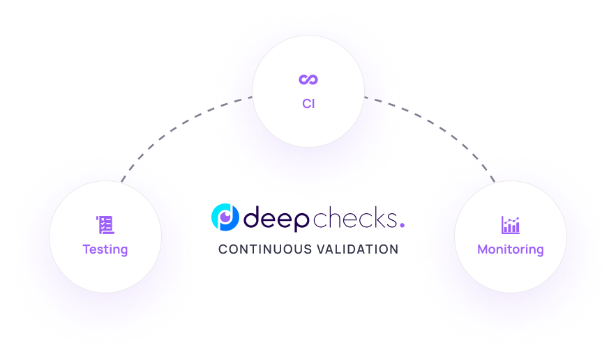

<!--
   ~ ----------------------------------------------------------------------------
   ~ Copyright (C) 2021-2023 Deepchecks (https://www.deepchecks.com)
   ~
   ~ This file is part of Deepchecks.
   ~ Deepchecks is distributed under the terms of the GNU Affero General
   ~ Public License (version 3 or later).
   ~ You should have received a copy of the GNU Affero General Public License
   ~ along with Deepchecks.  If not, see <http://www.gnu.org/licenses/>.
   ~ ----------------------------------------------------------------------------
   ~
-->

[](https://GitHub.com/deepchecks/deepchecks/stargazers/)


[](https://codeclimate.com/github/deepchecks/deepchecks/maintainability)
[](https://coveralls.io/github/deepchecks/deepchecks?branch=main) 
<!-- ALL-CONTRIBUTORS-BADGE:START - Do not remove or modify this section -->
[](#https://github.com/deepchecks/deepchecks/blob/main/CONTRIBUTING.rst)
<!-- ALL-CONTRIBUTORS-BADGE:END --> 

<!---
this badge takes quite some space, can re-add it if wanted

--->


<h1 align="center">
   Deepchecks - Continuous Validation for AI & ML: Testing, CI & Monitoring
</h1>

Deepchecks is a holistic open-source solution for all of your AI & ML validation needs,
enabling you to thoroughly test your data and models from research to production.


<a target="_blank" href="https://docs.deepchecks.com/?utm_source=github.com&utm_medium=referral&utm_campaign=readme&utm_content=logo">
   <picture>
      <source media="(prefers-color-scheme: dark)" srcset="docs/source/_static/images/readme/deepchecks_continuous_validation_dark.png">
      <source media="(prefers-color-scheme: light)" srcset="docs/source/_static/images/readme/deepchecks_continuous_validation_light.png">
      
   </picture>
</a>

<p align="center">
   &emsp;
   <a href="https://www.deepchecks.com/slack">👋 Join Slack</a>
   &emsp; | &emsp; 
   <a href="https://docs.deepchecks.com/?utm_source=github.com&utm_medium=referral&utm_campaign=readme&utm_content=top_links">📖 Documentation</a>
   &emsp; | &emsp; 
   <a href="https://deepchecks.com/blog/?utm_source=github.com&utm_medium=referral&utm_campaign=readme&utm_content=top_links">🌐 Blog</a>
   &emsp; | &emsp;  
   <a href="https://twitter.com/deepchecks">🐦 Twitter</a>
   &emsp;
</p>
   

## 🧩 Components

Deepchecks includes:
- **Deepchecks Testing**
  ([Quickstart](#---------deepchecks-testing-quickstart------), 
  [docs](https://docs.deepchecks.com/stable/?utm_source=github.com&utm_medium=referral&utm_campaign=readme&utm_content=components)): 
  - Running built-in & your own custom Checks and Suites for Tabular, NLP & CV validation (open source).
- **CI & Testing Management**
  ([Quickstart](#---------deepchecks-ci--testing-management-quickstart------), 
  [docs](https://docs.deepchecks.com/stable/general/usage/ci_cd.html?utm_source=github.com&utm_medium=referral&utm_campaign=readme&utm_content=components)):
  - Collaborating over test results and iterating efficiently until 
  model is production-ready and can be deployed (open source & managed offering).
- **Deepchecks Monitoring**
  ([Quickstart](#---------deepchecks-monitoring-quickstart------), 
  [docs](https://docs.deepchecks.com/monitoring/stable/?utm_source=github.com&utm_medium=referral&utm_campaign=readme&utm_content=components)): 
  - Tracking and validating your deployed models behavior when in production (open source & managed offering).

This repo is our main repo as all components use the deepchecks checks in their core. See the [Getting Started](#--getting-started) section for more information about installation and quickstarts for each of the components.
If you want to see deepchecks monitoring's code, you can check out the 
[deepchecks/monitoring](https://github.com/deepchecks/monitoring) repo.


## ⏩  Getting Started

<details close>
   <summary>
      <h3>
         💻 Installation
      </h3>
   </summary>

#### Deepchecks Testing (and CI) Installation

```bash
pip install deepchecks -U --user
```

For installing the nlp / vision submodules or with conda:
- For NLP: Replace ``deepchecks`` with ``"deepchecks[nlp]"``, 
  and optionally install also``deepchecks[nlp-properties]``
- For Computer Vision: Replace ``deepchecks`` with ``"deepchecks[vision]"``. 
- For installing with conda, similarly use: ``conda install -c conda-forge deepchecks``.

Check out the full installation instructions for deepchecks testing [here](https://docs.deepchecks.com/stable/getting-started/installation.html).

#### Deepchecks Monitoring Installation

To use deepchecks for production monitoring, you can either use our SaaS service, or deploy a local instance in one line on Linux/MacOS (Windows is WIP!) with Docker.
Create a new directory for the installation files, open a terminal within that directory and run the following:

```
pip install deepchecks-installer
deepchecks-installer install-monitoring
```

This will automatically download the necessary dependencies, run the installation process
and then start the application locally.

The installation will take a few minutes. Then you can open the deployment url (default is http://localhost),
and start the system onboarding. Check out the full monitoring [open source installation & quickstart](https://docs.deepchecks.com/monitoring/stable/getting-started/deploy_self_host_open_source.html).

Note that the open source product is built such that each deployment supports monitoring of
a single model.

</details>

### 🏃‍♀️ Quickstarts


<details open>
   <summary>
      <h4>
         Deepchecks Testing Quickstart
      </h4>
   </summary>

Jump right into the respective quickstart docs:

- [Tabular Quickstarts](https://docs.deepchecks.com/stable/tabular/auto_tutorials/quickstarts/index.html)
- [NLP Quickstarts](https://docs.deepchecks.com/stable/nlp/auto_tutorials/quickstarts/index.html)
- [Vision Quickstarts](https://docs.deepchecks.com/stable/vision/auto_tutorials/quickstarts/index.html) 

to have it up and running on your data.

Inside the quickstarts, you'll see how to create the relevant deepchecks object for holding your data and metadata
([Dataset](https://docs.deepchecks.com/stable/tabular/usage_guides/dataset_object.html?utm_source=github.com&utm_medium=referral&utm_campaign=readme&utm_content=running_a_suite), [TextData](https://docs.deepchecks.com/stable/nlp/usage_guides/text_data_object.html?utm_source=github.com&utm_medium=referral&utm_campaign=readme&utm_content=running_a_suite) or [VisionData](https://docs.deepchecks.com/stable/vision/usage_guides/visiondata_object.html), corresponding to the data type), and run a Suite or Check.
The code snippet for running it will look something like the following, depending on the chosen Suite or Check.

```python
from deepchecks.tabular.suites import model_evaluation
suite = model_evaluation()
suite_result = suite.run(train_dataset=train_dataset, test_dataset=test_dataset, model=model)
suite_result.save_as_html() # replace this with suite_result.show() or suite_result.show_in_window() to see results inline or in window
# or suite_result.results[0].value with the relevant check index to process the check result's values in python
```

The output will be a report that enables you to inspect the status and results of the chosen checks:

<p align="center">
   
</p>

</details>

<details open>
   <summary>
      <h4>
         Deepchecks Monitoring Quickstart
      </h4>
   </summary>

Jump right into the 
[open source monitoring quickstart docs](https://docs.deepchecks.com/monitoring/stable/getting-started/deploy_self_host_open_source.html)
to have it up and running on your data.
You'll then be able to see the checks results over time, set alerts, and interact
with the dynamic deepchecks UI that looks like this:

<p align="center">
   
</p>

</details>

<details open>
   <summary>
      <h4>
         Deepchecks CI & Testing Management Quickstart
      </h4>
   </summary>

Deepchecks managed CI & Testing management is currently in closed preview.
[Book a demo](https://deepchecks.com/book-demo/) for more information about the offering.

<p align="center">
   
</p>

For building and maintaining your own CI process while utilizing Deepchecks Testing for it,
check out our [docs for Using Deepchecks in CI/CD](https://docs.deepchecks.com/stable/general/usage/ci_cd.html).

</details>


## 🧮 How does it work?

At its core, deepchecks includes a wide variety of built-in Checks,
for testing all types of data and model related issues.
These checks are implemented for various models and data types (Tabular, NLP, Vision), 
and can easily be customized and expanded. 

The check results can be used to automatically make informed decisions
about your model's production-readiness, and for monitoring it over time in production.
The check results can be examined with visual reports (by saving them to an HTML file, or seeing them in Jupyter),
processed with code (using their pythonic / json output), and inspected and collaborated on with Deepchecks' dynamic UI 
(for examining test results and for production monitoring).

<!---
At its core, Deepchecks has a wide variety of built-in Checks and Suites (lists of checks) 
for all data types (Tabular, NLP, Vision), 
These includes checks for validating your model's performance (e.g. identify weak segments), the data's 
distribution (e.g. detect drifts or leakages), data integrity (e.g. find conflicting labels) and more.
These checks results can be run manually (e.g. during research) or triggered automatically (e.g. during CI
and production monitoring) and enable automatically making informed decisions regarding your model pipelines' 
production-readiness, and behavior over time.
--->


<details open>
   <summary>
      <h2>
         ✅ Deepchecks' Core: The Checks
      </h2>
   </summary>

- All of the Checks and the framework for customizing them are implemented inside 
  the Deepchecks Testing Python package (this repo).
- Each check tests for a specific potential problem. Deepchecks has many pre-implemented checks for
  finding issues with the model's performance (e.g. identifying weak segments), 
  data distribution (e.g. detect drifts or leakages) and data integrity (e.g. find conflicting labels).
- Customizable: each check has many configurable parameters, and custom checks can easily be implemented.
- Can be run manually (during research) or triggered automatically (in CI processes or production monitoring)
- Check results can be consumed by: 
   - Visual output report - [Saving to HTML](https://docs.deepchecks.com/stable/general/usage/export_save_results.html)(``result.save_to_html('output_report_name.html')``) or [viewing them](https://docs.deepchecks.com/stable/general/usage/showing_results.html) in Jupyter (``result.show()``).
   - Processing with code - with python using the check result's ``value`` attribute, or saving a 
     [JSON output](https://docs.deepchecks.com/stable/general/usage/export_save_results.html)
   - Deepchecks' UI - for dynamic inspection and collaboration (of test results and production monitoring)
- Optional conditions can be added and customized, to automatically validate check results,
  with a a pass ✓, fail ✖ or warning ! status
- An ordered list of checks (with optional conditions) can be run together in a "Suite"
  (and the output is a concluding report of all checks that ran)

</details>

<!---
These checks can be run manually (e.g. during research) or automatically triggered (with CI processes or in scheduled runs for production monitoring).
The check's results can be examined with visual reports (by saving them to an HTML file, or seeing them in Jupyter),
processed with code (using their json output), and inspected and collaborated upon with a dynamic UI 
(for examining test results and for production monitoring).
Optional conditions can be added to each check, to automatically validate whether it passed or not.
--->


## 📜 Open Source vs Paid 

Deepchecks' projects (``deepchecks/deepchecks`` & ``deepchecks/monitoring``) are open source and are released under [AGPL 3.0](./LICENSE).

The only exception are the Deepchecks Monitoring components (in the ``deepchecks/monitoring`` repo), that are under the 
([backend/deepchecks_monitoring/ee](https://github.com/deepchecks/monitoring/tree/main/backend/deepchecks_monitoring/ee)) 
directory, that are subject to a commercial license (see the license [here](https://deepchecks.com/terms-and-conditions)).
That directory isn't used by default, and is packaged as part of the deepchecks monitoring repository simply to 
support upgrading to the commercial edition without downtime.

Enabling premium features (contained in the `backend/deepchecks_monitoring/ee` directory) with a self-hosted instance requires a Deepchecks license. 
To learn more, [book a demo](https://deepchecks.com/book-demo/) or see our [pricing page](https://deepchecks.com/pricing).

Looking for a 💯% open-source solution for deepcheck monitoring?
Check out the [Monitoring OSS](https://github.com/deepchecks/monitoring-oss) repository, which is purged of all proprietary code and features.

## 👭 Community, Contributing, Docs & Support

Deepchecks is an open source solution. 
We are committed to a transparent development process and highly appreciate any contributions. 
Whether you are helping us fix bugs, propose new features, improve our documentation or spread the word,
we would love to have you as part of our community.

- Give us a ⭐️ github star ⭐️ on the top of this page to support what we're doing,
  it means a lot for open source projects!
- Read our 
  [docs](https://docs.deepchecks.com/?utm_source=github.com&utm_medium=referral&utm_campaign=readme&utm_content=docs)
  for more info about how to use and customize deepchecks, and for step-by-step tutorials.
- Post a [Github
  Issue](https://github.com/deepchecks/deepchecks/issues) to submit a bug report, feature request, or suggest an improvement.
- To contribute to the package, check out our [first good issues](https://github.com/deepchecks/deepchecks/contribute)
  and [contribution guidelines](CONTRIBUTING.rst), and open a PR.

Join our Slack to give us feedback, connect with the maintainers and fellow users, ask questions, 
get help for package usage or contributions, or engage in discussions about ML testing!

<a href="https://deepchecks.com/slack"></a>


## ✨ Contributors

Thanks goes to these wonderful people ([emoji
key](https://allcontributors.org/docs/en/emoji-key)):


<!-- ALL-CONTRIBUTORS-LIST:START - Do not remove or modify this section -->
<!-- prettier-ignore-start -->
<!-- markdownlint-disable -->
<table>
  <tbody>
    <tr>
      <td align="center" valign="top" width="14.28%"><a href="https://github.com/ItayGabbay"><br /><sub><b>Itay Gabbay</b></sub></a><br /><a href="#code-ItayGabbay" title="Code">💻</a> <a href="#doc-ItayGabbay" title="Documentation">📖</a> <a href="#ideas-ItayGabbay" title="Ideas, Planning, & Feedback">🤔</a></td>
      <td align="center" valign="top" width="14.28%"><a href="https://github.com/matanper"><br /><sub><b>matanper</b></sub></a><br /><a href="#doc-matanper" title="Documentation">📖</a> <a href="#ideas-matanper" title="Ideas, Planning, & Feedback">🤔</a> <a href="#code-matanper" title="Code">💻</a></td>
      <td align="center" valign="top" width="14.28%"><a href="https://github.com/JKL98ISR"><br /><sub><b>JKL98ISR</b></sub></a><br /><a href="#ideas-JKL98ISR" title="Ideas, Planning, & Feedback">🤔</a> <a href="#code-JKL98ISR" title="Code">💻</a> <a href="#doc-JKL98ISR" title="Documentation">📖</a></td>
      <td align="center" valign="top" width="14.28%"><a href="https://github.com/yromanyshyn"><br /><sub><b>Yurii Romanyshyn</b></sub></a><br /><a href="#ideas-yromanyshyn" title="Ideas, Planning, & Feedback">🤔</a> <a href="#code-yromanyshyn" title="Code">💻</a> <a href="#doc-yromanyshyn" title="Documentation">📖</a></td>
      <td align="center" valign="top" width="14.28%"><a href="https://github.com/noamzbr"><br /><sub><b>Noam Bressler</b></sub></a><br /><a href="#code-noamzbr" title="Code">💻</a> <a href="#doc-noamzbr" title="Documentation">📖</a> <a href="#ideas-noamzbr" title="Ideas, Planning, & Feedback">🤔</a></td>
      <td align="center" valign="top" width="14.28%"><a href="https://github.com/nirhutnik"><br /><sub><b>Nir Hutnik</b></sub></a><br /><a href="#code-nirhutnik" title="Code">💻</a> <a href="#doc-nirhutnik" title="Documentation">📖</a> <a href="#ideas-nirhutnik" title="Ideas, Planning, & Feedback">🤔</a></td>
      <td align="center" valign="top" width="14.28%"><a href="https://github.com/Nadav-Barak"><br /><sub><b>Nadav-Barak</b></sub></a><br /><a href="#code-Nadav-Barak" title="Code">💻</a> <a href="#doc-Nadav-Barak" title="Documentation">📖</a> <a href="#ideas-Nadav-Barak" title="Ideas, Planning, & Feedback">🤔</a></td>
    </tr>
    <tr>
      <td align="center" valign="top" width="14.28%"><a href="https://github.com/TheSolY"><br /><sub><b>Sol</b></sub></a><br /><a href="#code-TheSolY" title="Code">💻</a> <a href="#doc-TheSolY" title="Documentation">📖</a> <a href="#ideas-TheSolY" title="Ideas, Planning, & Feedback">🤔</a></td>
      <td align="center" valign="top" width="14.28%"><a href="http://www.linkedin.com/in/dan-arlowski"><br /><sub><b>DanArlowski</b></sub></a><br /><a href="#code-DanArlowski" title="Code">💻</a> <a href="#infra-DanArlowski" title="Infrastructure (Hosting, Build-Tools, etc)">🚇</a></td>
      <td align="center" valign="top" width="14.28%"><a href="https://github.com/benisraeldan"><br /><sub><b>DBI</b></sub></a><br /><a href="#code-benisraeldan" title="Code">💻</a></td>
      <td align="center" valign="top" width="14.28%"><a href="https://github.com/OrlyShmorly"><br /><sub><b>OrlyShmorly</b></sub></a><br /><a href="#design-OrlyShmorly" title="Design">🎨</a></td>
      <td align="center" valign="top" width="14.28%"><a href="https://github.com/shir22"><br /><sub><b>shir22</b></sub></a><br /><a href="#ideas-shir22" title="Ideas, Planning, & Feedback">🤔</a> <a href="#doc-shir22" title="Documentation">📖</a> <a href="#talk-shir22" title="Talks">📢</a></td>
      <td align="center" valign="top" width="14.28%"><a href="https://github.com/yaronzo1"><br /><sub><b>yaronzo1</b></sub></a><br /><a href="#ideas-yaronzo1" title="Ideas, Planning, & Feedback">🤔</a> <a href="#content-yaronzo1" title="Content">🖋</a></td>
      <td align="center" valign="top" width="14.28%"><a href="https://github.com/ptannor"><br /><sub><b>ptannor</b></sub></a><br /><a href="#ideas-ptannor" title="Ideas, Planning, & Feedback">🤔</a> <a href="#content-ptannor" title="Content">🖋</a></td>
    </tr>
    <tr>
      <td align="center" valign="top" width="14.28%"><a href="https://github.com/avitzd"><br /><sub><b>avitzd</b></sub></a><br /><a href="#eventOrganizing-avitzd" title="Event Organizing">📋</a> <a href="#video-avitzd" title="Videos">📹</a></td>
      <td align="center" valign="top" width="14.28%"><a href="https://github.com/DanBasson"><br /><sub><b>DanBasson</b></sub></a><br /><a href="#doc-DanBasson" title="Documentation">📖</a> <a href="#bug-DanBasson" title="Bug reports">🐛</a> <a href="#example-DanBasson" title="Examples">💡</a></td>
      <td align="center" valign="top" width="14.28%"><a href="https://github.com/kishore-s-15"><br /><sub><b>S.Kishore</b></sub></a><br /><a href="#code-Kishore-s-15" title="Code">💻</a> <a href="#doc-Kishore-s-15" title="Documentation">📖</a> <a href="#bug-Kishore-s-15" title="Bug reports">🐛</a></td>
      <td align="center" valign="top" width="14.28%"><a href="http://www.shaypalachy.com/"><br /><sub><b>Shay Palachy-Affek</b></sub></a><br /><a href="#data-Shaypal5" title="Data">🔣</a> <a href="#example-Shaypal5" title="Examples">💡</a> <a href="#userTesting-Shaypal5" title="User Testing">📓</a></td>
      <td align="center" valign="top" width="14.28%"><a href="https://github.com/cemalgurpinar"><br /><sub><b>Cemal GURPINAR</b></sub></a><br /><a href="#doc-cemalgurpinar" title="Documentation">📖</a> <a href="#bug-cemalgurpinar" title="Bug reports">🐛</a></td>
      <td align="center" valign="top" width="14.28%"><a href="https://github.com/daavoo"><br /><sub><b>David de la Iglesia Castro</b></sub></a><br /><a href="#code-daavoo" title="Code">💻</a></td>
      <td align="center" valign="top" width="14.28%"><a href="https://github.com/Tak"><br /><sub><b>Levi Bard</b></sub></a><br /><a href="#doc-Tak" title="Documentation">📖</a></td>
    </tr>
    <tr>
      <td align="center" valign="top" width="14.28%"><a href="https://github.com/julienschuermans"><br /><sub><b>Julien Schuermans</b></sub></a><br /><a href="#bug-julienschuermans" title="Bug reports">🐛</a></td>
      <td align="center" valign="top" width="14.28%"><a href="http://www.nirbenzvi.com"><br /><sub><b>Nir Ben-Zvi</b></sub></a><br /><a href="#code-nirbenz" title="Code">💻</a> <a href="#ideas-nirbenz" title="Ideas, Planning, & Feedback">🤔</a></td>
      <td align="center" valign="top" width="14.28%"><a href="https://ashtavakra.org"><br /><sub><b>Shiv Shankar Dayal</b></sub></a><br /><a href="#infra-shivshankardayal" title="Infrastructure (Hosting, Build-Tools, etc)">🚇</a></td>
      <td align="center" valign="top" width="14.28%"><a href="https://github.com/RonItay"><br /><sub><b>RonItay</b></sub></a><br /><a href="#bug-RonItay" title="Bug reports">🐛</a> <a href="#code-RonItay" title="Code">💻</a></td>
      <td align="center" valign="top" width="14.28%"><a href="http://jeroen.vangoey.be"><br /><sub><b>Jeroen Van Goey</b></sub></a><br /><a href="#bug-BioGeek" title="Bug reports">🐛</a> <a href="#doc-BioGeek" title="Documentation">📖</a></td>
      <td align="center" valign="top" width="14.28%"><a href="https://about.me/ido.weiss"><br /><sub><b>idow09</b></sub></a><br /><a href="#bug-idow09" title="Bug reports">🐛</a> <a href="#example-idow09" title="Examples">💡</a></td>
      <td align="center" valign="top" width="14.28%"><a href="https://bandism.net/"><br /><sub><b>Ikko Ashimine</b></sub></a><br /><a href="#doc-eltociear" title="Documentation">📖</a></td>
    </tr>
    <tr>
      <td align="center" valign="top" width="14.28%"><a href="https://github.com/jhwohlgemuth"><br /><sub><b>Jason Wohlgemuth</b></sub></a><br /><a href="#doc-jhwohlgemuth" title="Documentation">📖</a></td>
      <td align="center" valign="top" width="14.28%"><a href="http://lokin.dev"><br /><sub><b>Lokin Sethia</b></sub></a><br /><a href="#code-alphabetagamer" title="Code">💻</a> <a href="#bug-alphabetagamer" title="Bug reports">🐛</a></td>
      <td align="center" valign="top" width="14.28%"><a href="http://www.ingomarquart.de"><br /><sub><b>Ingo Marquart</b></sub></a><br /><a href="#code-IngoStatworx" title="Code">💻</a> <a href="#bug-IngoStatworx" title="Bug reports">🐛</a></td>
      <td align="center" valign="top" width="14.28%"><a href="https://github.com/osw282"><br /><sub><b>Oscar</b></sub></a><br /><a href="#code-osw282" title="Code">💻</a></td>
      <td align="center" valign="top" width="14.28%"><a href="https://github.com/rcwoolston"><br /><sub><b>Richard W</b></sub></a><br /><a href="#code-rcwoolston" title="Code">💻</a> <a href="#doc-rcwoolston" title="Documentation">📖</a> <a href="#ideas-rcwoolston" title="Ideas, Planning, & Feedback">🤔</a></td>
      <td align="center" valign="top" width="14.28%"><a href="https://github.com/bgalvao"><br /><sub><b>Bernardo</b></sub></a><br /><a href="#code-bgalvao" title="Code">💻</a> <a href="#doc-bgalvao" title="Documentation">📖</a></td>
      <td align="center" valign="top" width="14.28%"><a href="https://olivierbinette.github.io/"><br /><sub><b>Olivier Binette</b></sub></a><br /><a href="#code-OlivierBinette" title="Code">💻</a> <a href="#doc-OlivierBinette" title="Documentation">📖</a> <a href="#ideas-OlivierBinette" title="Ideas, Planning, & Feedback">🤔</a></td>
    </tr>
    <tr>
      <td align="center" valign="top" width="14.28%"><a href="https://github.com/chendingyan"><br /><sub><b>陈鼎彦</b></sub></a><br /><a href="#bug-chendingyan" title="Bug reports">🐛</a></td>
      <td align="center" valign="top" width="14.28%"><a href="https://www.k-lab.tk/"><br /><sub><b>Andres Vargas</b></sub></a><br /><a href="#doc-vargasa" title="Documentation">📖</a></td>
      <td align="center" valign="top" width="14.28%"><a href="https://github.com/MichaelMarien"><br /><sub><b>Michael Marien</b></sub></a><br /><a href="#doc-MichaelMarien" title="Documentation">📖</a> <a href="#bug-MichaelMarien" title="Bug reports">🐛</a></td>
      <td align="center" valign="top" width="14.28%"><a href="https://github.com/mglowacki100"><br /><sub><b>OrdoAbChao</b></sub></a><br /><a href="#code-mglowacki100" title="Code">💻</a></td>
      <td align="center" valign="top" width="14.28%"><a href="https://github.com/thewchan"><br /><sub><b>Matt Chan</b></sub></a><br /><a href="#code-thewchan" title="Code">💻</a></td>
      <td align="center" valign="top" width="14.28%"><a href="https://github.com/hjain5164"><br /><sub><b>Harsh Jain</b></sub></a><br /><a href="#code-hjain5164" title="Code">💻</a> <a href="#doc-hjain5164" title="Documentation">📖</a> <a href="#bug-hjain5164" title="Bug reports">🐛</a></td>
      <td align="center" valign="top" width="14.28%"><a href="https://github.com/arterm-sedov"><br /><sub><b>arterm-sedov</b></sub></a><br /><a href="#doc-arterm-sedov" title="Documentation">📖</a></td>
    </tr>
    <tr>
      <td align="center" valign="top" width="14.28%"><a href="https://www.kaggle.com/rayanaay"><br /><sub><b>AIT ALI YAHIA Rayane</b></sub></a><br /><a href="#code-RayanAAY-ops" title="Code">💻</a> <a href="#ideas-RayanAAY-ops" title="Ideas, Planning, & Feedback">🤔</a></td>
    </tr>
  </tbody>
</table>

<!-- markdownlint-restore -->
<!-- prettier-ignore-end -->

<!-- ALL-CONTRIBUTORS-LIST:END -->

This project follows the [all-contributors](https://allcontributors.org)
specification. Contributions of any kind are welcome!
