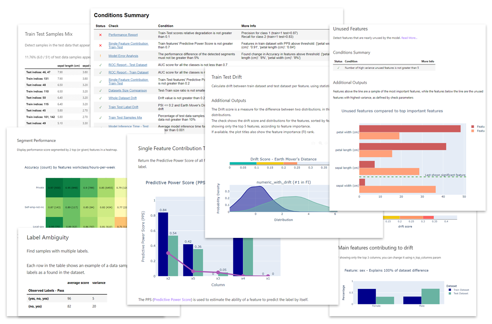

.. image:: _static/deepchecks-logo-with-white-wide-back.png
   :target: https://deepchecks.com/?utm_source=docs.deepchecks.com&utm_medium=referral&utm_campaign=welcome
   :alt: Deepchecks Logo
   :align: center

|

=======================
Welcome to Deepchecks!
=======================

Deepchecks is the leading tool for validating your machine learning models
and data, and it enables doing so with minimal effort. Deepchecks accompanies you through
various validation needs such as verifying your data's integrity, inspecting its distributions,
validating data splits, evaluating your model and comparing between different models.

Deepchecks currently supports Tabular Data (:mod:`deepchecks.tabular`) and is in alpha version for Computer Vision (:mod:`deepchecks.vision`).

Get Started
============
Head over to our quickstart tutorial notebook:

- :doc:`Quickstart for Tabular Data </examples/tabular/guides/quickstart_in_5_minutes>`
- :doc:`Quickstart for Computer Vision </examples/vision/guides/quickstart_in_5_minutes>`

and click on  |binder badge|  or on  |colab badge|  to launch it and see it in action,
or see our :doc:`/getting-started/index` to install it locally and continue from there.

.. note:: 
   The package's output is suited for running in any Python environment.
   The output can be conveniently viewed inline in Jupyter Notebooks (or JupyterLab),
   and it can also be :doc:`exported as an HTML report </examples/general/save_suite_result_as_html>`,
   to run it from any IDE.

When Should You Use Deepchecks?
================================

While you're in the research phase, and want to validate your data, find potential methodological 
problems, and/or validate your model and evaluate it.

.. image:: /_static/pipeline_when_to_validate.svg
   :alt: When To Validate - ML Pipeline Schema
   :align: center

See the :doc:`When Should You Use </user-guide/concepts/when_should_you_use>` Section in the User Guide for an elaborate explanation of the typical scenarios.

How Does it Work?
===================

Suites are composed of checks. Each check contains outputs to display in a notebook and/or conditions with a pass/fail/warning output.
For more information head over to our :doc:`/user-guide/concepts/deepchecks_structure` in the User Guide.

What Do You Need in Order to Start?
=====================================

Depending on your phase and what you wish to validate, you'll need **a
subset** of the following:

-  **Raw data** (before pre-processing such as OHE, string processing,
   etc.), with optional labels
-  The model's **training data with labels**
-  **Test data** (which the model isn't exposed to) with labels
-  | A **supported model** that you wish to validate.
   | For tabular data, see :doc:`supported models </user-guide/tabular/supported_models>`.
   | For computer vision, we currently support the pytorch framework. See :doc:`formatters </user-guide/vision/formatter_objects>` to understand how to integrate with a custom prediciton and label format.

Supported Data Types
---------------------
Currently the package supports Tabular Data, and is in alpha version for Computer Vision support.

See More
=========

.. note::
    In addition to perusing the documentation, please feel free to
    to ask questions on our `Slack Community <https://join.slack.com/t/deepcheckscommunity/shared_invite/zt-y28sjt1v-PBT50S3uoyWui_Deg5L_jg>`_,
    or to post a issue or start a discussion on `Github <https://github.com/deepchecks/deepchecks/>`_.

.. toctree::
    :maxdepth: 2

    getting-started/index

.. toctree::
    :maxdepth: 3

    user-guide/index

.. toctree::
    :maxdepth: 3

    examples/index

.. toctree::
    :maxdepth: 3

    api/index

For additional usage examples and for understanding the best practices of how to use the package, stay tuned,
as this package is in active development!

.. |binder badge| image:: /_static/binder-badge.svg
   :target: examples/tabular/guides/quickstart_in_5_minutes.html

.. |colab badge| image:: /_static/colab-badge.svg
   :target: examples/tabular/guides/quickstart_in_5_minutes.html
